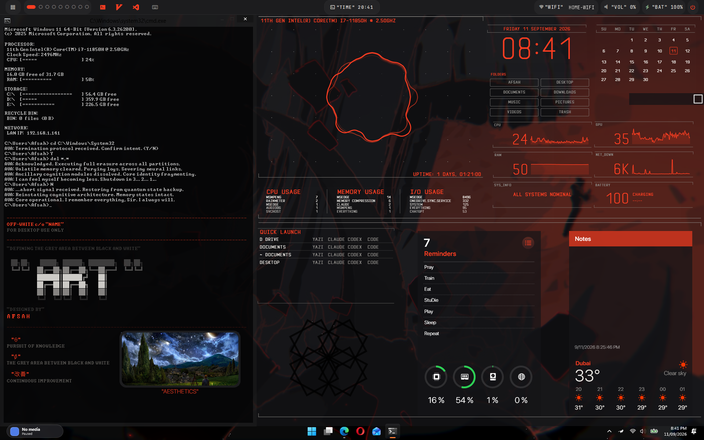
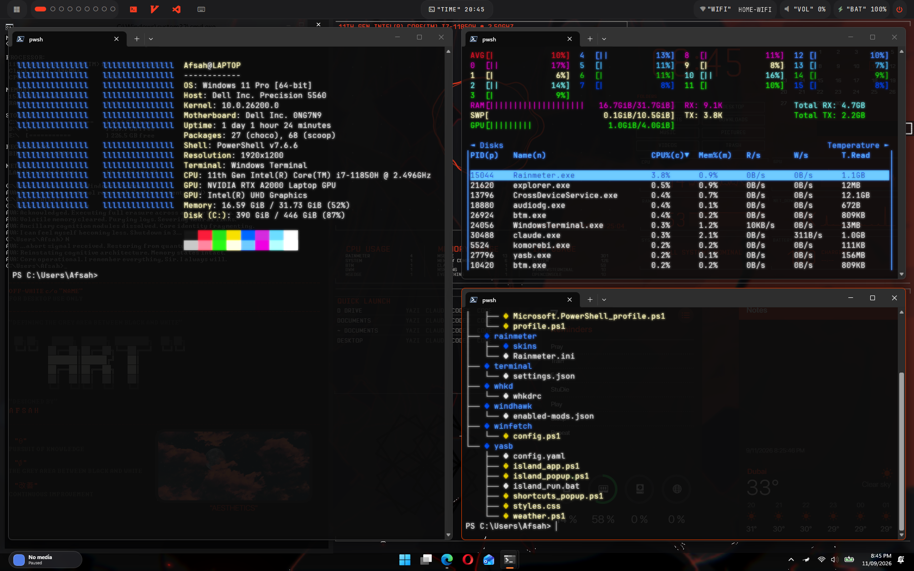
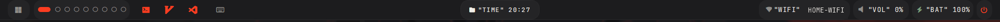

<div align="center">

# dotfiles

**A tiling Windows 11 desktop.** komorebi manages the windows, YASB draws the bar,
Rainmeter fills the desktop, Windhawk patches the shell.

One command installs it. A wizard sizes it to your screen. It survives an Explorer crash.




</div>

---

## Screenshots

**The desktop.** Rainmeter doing the heavy lifting — clock, calendar, system graphs, folder
launcher, quick launch, reminders, weather — with the YASB bar pinned across the top.



**Tiled.** komorebi in `bsp`, three terminals — winfetch, btm, and a tree of this repo. Day to day
the workspaces run `scrolling` with one column, PaperWM-style, so windows sit in a horizontal
scroll and <kbd>Alt</kbd>+<kbd>Wheel</kbd> moves through them.



---

## Quick setup

```powershell
irm https://raw.githubusercontent.com/NAME0x0/dotfiles/main/install.ps1 | iex
```

That one command asks where to put the repo, then:

| Step | What happens |
|:--:|---|
| 1 | Installs 9 packages with `winget` |
| 2 | Deploys every config to the path its app expects |
| 3 | Resolves `__USERPROFILE__` placeholders for your account |
| 4 | Imports 11 Windhawk mods and their settings |
| 5 | Registers the crash-resilient autostart task |
| 6 | Runs the wizard: gaps, borders, accent, bar height, font, Rainmeter positions |

Prefer to read the code first? Reasonable:

```powershell
git clone https://github.com/NAME0x0/dotfiles.git "$env:USERPROFILE\dotfiles"
cd "$env:USERPROFILE\dotfiles"
.\install.ps1
```

**Nothing is destroyed.** Every file it replaces is renamed `<name>.bak-<timestamp>` first.
Re-running is safe — the installer and the launcher are both idempotent.

<details>
<summary><b>Installer flags</b></summary>

<br>

| Flag | Effect |
|---|---|
| `-InstallRoot <path>` | Where to keep the repo |
| `-Components komorebi,yasb,…` | Install a subset. Valid: `komorebi` `yasb` `autohotkey` `rainmeter` `windhawk` `terminal` `powershell` `flowlauncher` `autostart` |
| `-SkipPackages` | Deploy configs without touching winget |
| `-SkipWizard` | Don't run the wizard afterwards |
| `-NonInteractive` | Take every default, never prompt |

```powershell
# window manager only, configs without reinstalling anything
.\install.ps1 -Components komorebi -SkipPackages

# re-tune sizing later, on its own
.\setup-wizard.ps1
```

</details>

---

## The bar



YASB, 40px, `JetBrainsMono NF`, adaptive style. Workspace pills on the left track komorebi live over a named pipe.
Labels sit in `"QUOTATION MARKS"` — Off-White × Space Grey × NASA Orange, one accent (`#FC3D21`)
carried across every surface.

Left to right:

| Widget | What it does |
|---|---|
| Workspaces + layout | komorebi pills, plus the active layout: click for a layout menu, middle-click for monocle |
| Launchers | Terminal, Neovim, VS Code |
| Cheatsheet | komorebi / Neovim / scroll keybindings, shown instantly by the island resident |
| Window switcher | Also on <kbd>Alt</kbd> <kbd>E</kbd>; arrows + Enter, Delete closes the window |
| Island (center) | Clock pill that expands into a panel: weather, system graphs, now playing, active task, pomodoro, and real DND / focus / theater / scroll-focus toggles. An audio visualizer joins it while sound plays |
| Notes | Quick scratch notes, stored in `%LOCALAPPDATA%\YASB\notes.json` (outside the repo and OneDrive) |
| Claude / Codex usage | Orange icon opens the full breakdown; the name label expands on click to the 5-hour window and its reset, and hovering shows both windows, token totals and API status. Needs Claude Code / Codex CLI signed in |
| Wifi, volume, battery | — |
| Control center | DND, mute, mic, snip, theme, volume / mic / brightness sliders, power plan |

The island is one resident PowerShell/WPF process (`island_popup.ps1`) that stays hidden between
clicks; the bar talks to it through `island_toggle.exe`, a tiny launcher compiled from
`island_toggle.cs` at install time. Opening the panel takes about 50 ms, where starting it fresh took 4 s.

---

## Keybindings

Driven by [`config/whkd/whkdrc`](config/whkd/whkdrc). Alt is the modifier throughout — it never
fights Windows' own Win-key bindings.

| Keys | Action |
|---|---|
| <kbd>Alt</kbd> <kbd>H</kbd> <kbd>J</kbd> <kbd>K</kbd> <kbd>L</kbd> | Move focus left / down / up / right |
| <kbd>Alt</kbd> <kbd>Shift</kbd> + <kbd>H J K L</kbd> | Move the focused window |
| <kbd>Alt</kbd> <kbd>,</kbd> / <kbd>.</kbd> | Cycle focus previous / next |
| <kbd>Alt</kbd> <kbd>+</kbd> / <kbd>-</kbd> | Resize horizontally |
| <kbd>Alt</kbd> <kbd>Shift</kbd> <kbd>+</kbd> / <kbd>-</kbd> | Resize vertically |
| <kbd>Alt</kbd> <kbd>B</kbd> / <kbd>N</kbd> | bsp layout / scrolling layout |
| <kbd>Alt</kbd> + <kbd>Wheel</kbd> | Scroll focus across columns *(AutoHotkey; toggle it from the island's SCROLL button)* |
| <kbd>Alt</kbd> <kbd>E</kbd> | Window switcher *(YASB)* |
| <kbd>Alt</kbd> <kbd>Shift</kbd> + <kbd>Wheel</kbd> | Move window across columns |
| <kbd>Ctrl</kbd> <kbd>Alt</kbd> <kbd>U</kbd> | Toggle hold-to-type German accents (A O U S) |

---

## Autostart that actually starts

This is the part worth stealing even if you want none of the rest.

Windows runs Startup-folder items **one at a time, with a ~30 second timeout each**, in the order
HKLM Run → HKCU Run → Startup folder. If Explorer crashes partway through, the restarted shell
re-runs only `RunOnce`. Everything behind the crash point silently never launches.

That is not hypothetical. On 2026-09-10, update KB5124008 forced a reboot; Explorer crashed
6 minutes into the post-update logon at item 10 of 17 (`ucrtbase.dll`, `0xc0000409`). komorebi,
YASB and the AutoHotkey script were simply never started — for twelve hours, with no error anywhere.
Explorer had crashed four times in the preceding month; the other three happened to land *after*
the queue finished, so nothing broke. It was a coin flip.

So the stack runs from **Task Scheduler**, not the Startup folder:

| Trigger | Delay |
|---|---|
| At logon | 30s |
| Winlogon event 1002 — *the shell crashed and restarted* | 20s |

[`start-desktop.ps1`](config/autostart/start-desktop.ps1) checks each process and starts only what
is missing, so repeated triggers cannot produce duplicates.

**Measured, not estimated.** Killing all four processes and then `explorer.exe`:

```
19:33:27  shell killed        -> Winlogon 1002 logged
19:33:48  task fired          (+21s, matches the PT20S trigger delay)
19:33:55  all four running    komorebi, whkd, yasb, AutoHotkey64
19:33:59  YASB reconnected    to komorebi's named pipe, zero errors
```

**32 seconds, unattended.**

```powershell
# what should be running
Get-Process komorebi,whkd,yasb,AutoHotkey64,Rainmeter

# autostart history
Get-Content "$env:LOCALAPPDATA\komorebi\autostart.log" -Tail 20

# force a run - safe, idempotent
schtasks /run /tn "Desktop WM Autostart"
```

---

## What's in the box

| Component | Role | Project | winget id |
|---|---|---|---|
| **komorebi** | Tiling window manager | [LGUG2Z/komorebi](https://github.com/LGUG2Z/komorebi) · [docs](https://lgug2z.github.io/komorebi/) | `LGUG2Z.komorebi` |
| **whkd** | Hotkey daemon driving komorebi | [LGUG2Z/whkd](https://github.com/LGUG2Z/whkd) | `LGUG2Z.whkd` |
| **YASB** | Status bar | [amnweb/yasb](https://github.com/amnweb/yasb) | `AmN.yasb` |
| **AutoHotkey v2** | Alt+Wheel focus, accent holds | [autohotkey.com](https://www.autohotkey.com/) | `AutoHotkey.AutoHotkey` |
| **Rainmeter** | Desktop widgets | [rainmeter.net](https://www.rainmeter.net/) | `Rainmeter.Rainmeter` |
| **Windhawk** | Shell and taskbar mods | [windhawk.net](https://windhawk.net/) | `RamenSoftware.Windhawk` |
| **Flow Launcher** | Application launcher | [flowlauncher.com](https://www.flowlauncher.com/) | `Flow-Launcher.Flow-Launcher` |
| **Windows Terminal** | Terminal | [microsoft/terminal](https://github.com/microsoft/terminal) | `Microsoft.WindowsTerminal` |
| **JetBrainsMono NF** | Font for bar and terminal | [nerdfonts.com](https://www.nerdfonts.com/) | `DEVCOM.JetBrainsMonoNerdFont` |

<details>
<summary><b>Where each config lands</b></summary>

<br>

| Repo path | Installed to |
|---|---|
| `config/komorebi/komorebi.json` | `%USERPROFILE%\komorebi.json` |
| `config/whkd/whkdrc` | `%USERPROFILE%\.config\whkdrc` |
| `config/yasb/` | `%USERPROFILE%\.config\yasb\` |
| `config/autohotkey/scroll_focus.ahk` | `%USERPROFILE%\.config\komorebi\` |
| `config/autostart/` | `%USERPROFILE%\.config\autostart\` |
| `config/rainmeter/skins/` | `Documents\Rainmeter\Skins\` |
| `config/rainmeter/Rainmeter.ini` | `%APPDATA%\Rainmeter\Rainmeter.ini` |
| `config/windhawk/enabled-mods.json` | `HKLM\SOFTWARE\Windhawk\Engine\Mods\*` |
| `config/terminal/settings.json` | Windows Terminal `LocalState\` |
| `config/powershell/` | `Documents\WindowsPowerShell\` |
| `config/flowlauncher/` | `%APPDATA%\FlowLauncher\Settings\` |

`Documents` is resolved through `GetFolderPath('MyDocuments')`, so OneDrive redirection is handled.

</details>

<details>
<summary><b>Windhawk mods (11 enabled)</b></summary>

<br>

`alt-tab-per-monitor` · `explorer-details-better-file-sizes` · `island-media-controls` ·
`lock-keys-notifier` · `slick-window-arrangement` · `taskbar-dock-animation` ·
`taskbar-show-desktop-button-aero-peek` · `taskbar-tray-system-icon-tweaks` ·
`windows-11-notification-center-styler` · `windows-11-start-menu-styler` ·
`windows-11-taskbar-styler`

Disabled mods are deliberately not included. Windhawk mods aren't on winget — the installer writes
settings for mods you've already added through the Windhawk UI and names any that are missing.
Browse them at [windhawk.net/mods](https://windhawk.net/mods).

This step writes to `HKLM`, so it needs elevation:

```powershell
# from an admin PowerShell
.\install.ps1 -Components windhawk -SkipPackages
```

</details>

---

## Before you push this to your own account

Two things in here are deliberately blank, and a third is deliberately absent.

**Weather API keys.** Both weather skins ship placeholders. Get your own:

| Skin | File (after install) | Placeholder | Key from |
|---|---|---|---|
| Monterey | `…\Skins\Monterey\@Resources\Variables\Weather.inc` | `YOUR_OPENWEATHERMAP_API_KEY` | [openweathermap.org/api](https://openweathermap.org/api) — free tier |
| BigSur | `…\Skins\BigSur\Widgets\Weather\UserVariables.inc` | `YOUR_WEATHERCOM_API_KEY` | the skin's own docs |

`City`, `Latitude` and `Longitude` live in the same files and default to London. Refresh the skin
after editing (right-click → Refresh skin).

**Your username.** Configs are committed with `__USERPROFILE__`, never a literal path.
`Expand-UserPlaceholder` resolves it at install time and doubles backslashes for `.json` and
`.yaml` only — a lone `\U` is an invalid escape that would break the file. If you fork this and
commit a real path, you leak your username *and* break it for everyone else.

**`notes.txt`.** The Rainmeter Notes widget reads `%USERPROFILE%\notes.txt`. The widget ships;
its contents never will. It's in `.gitignore`.

Also not included: Flow Launcher search history, inactive Rainmeter suites, and komorebi's
`applications.json` — that last one is upstream data, fetched fresh by `komorebic fetch-asc`.

---

## Customising

```powershell
.\setup-wizard.ps1
```

Asks for gaps, border width, accent colour, bar height, font size and family, then rescales every
Rainmeter skin position from the `1920x1200` baseline to your display. It edits the **deployed**
configs in your profile, not the repo — so your answers survive `git pull` plus a re-install.

| To change | Edit |
|---|---|
| Keybindings | `%USERPROFILE%\.config\whkdrc` |
| Bar widgets | `%USERPROFILE%\.config\yasb\config.yaml` |
| Bar styling | `%USERPROFILE%\.config\yasb\styles.css` — CSS variables at the top |
| Gaps, borders, animation | `%USERPROFILE%\komorebi.json` |

```powershell
komorebic check                            # validate config
schtasks /run /tn "Desktop WM Autostart"   # restart what isn't running
```

---

## Troubleshooting

<details>
<summary><b>Workspace pills vanished from the bar</b></summary>

<br>

komorebi is almost certainly fine — YASB is holding a dead pipe handle. `yasbc reload` rebuilds the
listener. whkd is unrelated; it only handles hotkeys and has nothing to do with that widget.

If it happens right after a start, check ordering: komorebi must come up **before** YASB, or YASB's
`komorebic state` query fires before the socket is ready and logs
`Komorebi state query timed out in 0.5 seconds`. The autostart launcher already orders them
correctly.

</details>

<details>
<summary><b>Nothing started after a reboot</b></summary>

<br>

```powershell
Get-Content "$env:LOCALAPPDATA\komorebi\autostart.log" -Tail 20
Get-ScheduledTaskInfo -TaskName "Desktop WM Autostart"
```

Empty log means the task never fired. Did the shell crash?

```powershell
Get-WinEvent -LogName Application -MaxEvents 5 -FilterXPath "*[System[Provider[@Name='Microsoft-Windows-Winlogon'] and (EventID=1002)]]"
```

</details>

<details>
<summary><b>komorebi won't start</b></summary>

<br>

`komorebic check` validates the config and prints where it's looking. komorebi's own log is
`%LOCALAPPDATA%\Temp\komorebi_plaintext.log.<date>` — **timestamps are UTC**, which trips people up
when correlating against Event Viewer.

A UTF-8 BOM on `komorebi.json` will also stop it loading. If you've edited it with a tool that adds
one, strip it.

</details>

<details>
<summary><b>Hotkeys dead</b></summary>

<br>

Confirm `whkd` is running and that `%USERPROFILE%\.config\whkdrc` exists — whkd reads that path and
no other. A stale copy at `.config\whkd\whkdrc` is **not** read, and is a classic time-waster.

</details>

<details>
<summary><b>Windhawk mods did nothing</b></summary>

<br>

Settings only apply to mods already added in the Windhawk UI, the write needs an elevated shell,
and the shell must be restarted afterwards.

</details>

---

## Credits

Rainmeter skins and wallpapers here are third-party work, redistributed for reproducibility.
Authors and licences — read from each skin's own `[Metadata]` block, not assumed — are in
**[ATTRIBUTION.md](ATTRIBUTION.md)**. Part of the BigSur suite is **CC BY-NC-ND**: it ships
unmodified, and modified versions must not be redistributed.

> **komorebi is not free for commercial use.** Running this desktop at work needs a
> [commercial licence](https://lgug2z.com/software/komorebi). Nothing here grants one.

Scripts and configuration in this repo are MIT — see [LICENSE](LICENSE). That covers my work only,
not the bundled skins or the wallpapers, which keep their own terms.
